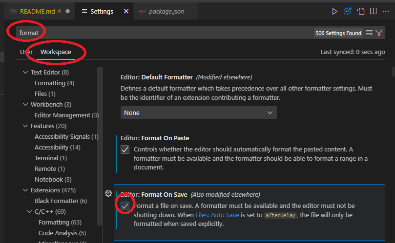

# Contributing to Groundwork Water

Thank you for your interest in contributing to Groundwork Water! Your help is appreciated. Please follow these guidelines to ensure a smooth contribution process.

To contribute to Groundwork-Water you _must_ be a member of the U.S. Army Corps of Engineers Water Management.

## How to Contribute

_Note: You must have nodejs installed and in your path!_

1. **Submit an issue**
   1. Create an [issue](https://github.com/USACE-WaterManagement/groundwork-water/issues) as bug or feature/etc
   2. If you wish to work the issue, ask for it to be assigned to you. If you can, assign it to yourself.
2. **Retrieve the Repository**
   - Non Core Developers:
     - Create your own fork and clone it locally.
   - Developers (Ask for access):
     - Clone the repository directory

3. **Create a Branch**

   _NOTE_: Try to use the "create branch" feature on the right sidebar of GitHub in the issue's given page

   If Not: Use a descriptive branch name for your feature or fix:

   ```bash
   git checkout -b feature/your-feature-name
   ```

   Or use VSCode to create the branch after step 2

4. **Install the root and docs packages**
   Install the required dependencies for the docs page and library with:
   From the root of the project run:
   `npm install`
   Then for the docs run
   `cd docs && npm install`

5. **Build the library**  
   **_NOTE_ you must do this each time you make changes to the library itself for the docs pages to work locally.**

   Read more below under [workflow recommendations](#workflow-recommendations) for how the local library linking works.

   From the root of the project you can build with:
   `npm run build`

6. **Make Changes**  
   Make your changes and attempt to commit one idea at a time within your branch to make it easier in review.

   _For example:_ If you need to rename a file or move it. You would do that, then commit that singular change.
   Or if you were adding a page path to the docs, you would make all the tweaks across the files to initialize the page and add it to the routes for that commit.

7. **Run Tests**  
   Use the local dev instance to manually test your changes and ensure they work. We use a form of [Dogfooding](https://en.wikipedia.org/wiki/Eating_your_own_dog_food) where we link the library to the documentation. Start the documentation locally. Then call the library itself in that documentation.

   To start the localhost instance of the docs site:
   (From root or /docs)

   ```bash
   npm run dev
   ```

8. **Commit Changes**  
   Use meaningful commit messages:

   ```bash
   git commit -m "Create path structure for useCdaBlob docs"
   ```

9. **Version your Code**  
   Run changesets to version your code.  
   To do this run:  
   `npx changesets patch`

We use semantic versioning, or semver. Read more here: https://semver.org/  
 In short:

- `major` if it **breaks** something.
- `minor` if it's a functionality that does _not_ break anything.
- `patch` if it's a bug fix that does _not_ break something.

10. **Push and Open a Pull Request**  
    Read more below about [PRs](#pull-requests)  
    Push your branch and open a pull request against the `main` branch. Describe your changes and reference any related issues.
    - If you have forked, you will create a PR from your branch.

Note: If `main` has changed significantly you will be required to rebase/merge main into your code to resolve merge conflicts before you can bring your changes into `main`.

## Code Style

For code styling we use `husky`.

On every commit, after you run `npm i` your code will be formatted to match the repository.

To help keep your code formatted while you make changes you might consider in vscode setting your default formatter to Prettier (VSCode extension) and in the settings for workspace setting it to format on save.

## Reporting Issues

- Report issues directly in VSCode. Using the issue submission tool consider labeling it with a priority to help us gauge if it is a blocker.
- Provide steps to reproduce bugs and relevant logs or screenshots.
- Do NOT post sensitive information such as:
  - IP Addresses
  - Usernames
  - Extended file paths
  - Other such information that could identify systems and/or the versions they are running

## Community Standards

- Be respectful and constructive in all communications.

## Questions?

Open an issue or start a discussion if you need help.

Thank you for helping improve Groundwork Water!

### Pull Requests

- Where possible, commits and pull requests should be [atomic](https://en.wikipedia.org/wiki/Atomic_commit):  
  _Keeping commits and PRs to one topic at a time_
  - To ensure reviewers can more easily review code revisions and not miss anything
  - Reduces the frequency of merge conflicts
  - Provides separation of concern (for bugs) when only one issue is merged at a time
- You _must_ rebase your branch to main before you submit Pull Requests:
  - [ Terminal ] _From your branch run_
    1. `git fetch origin`
    2. `git rebase origin/main`
  - [ GUI ] In VSCode:  
    This can also be done in VSCode using the `Version Control` menu:  
     

### Workflow Recommendations

- Use `npm link` to connect your project or the `docs` to the local generated `groundwork-water`
  - See the `link` script in `package.json` for details
- Commit Often - [Atomic Commits](https://en.wikipedia.org/wiki/Atomic_commit)
  - i.e. if you update style of plot, do a commit related to "Update plotxyz style" then move on to next item/commit
- Use VSCode or Similar Featured Editor to provide advanced features, save time, and integrate various utilities:
  - Command Prompt in VSCode : [Integrated Terminal](https://code.visualstudio.com/docs/terminal/getting-started)
  - [Tips & Tricks](https://code.visualstudio.com/docs/getstarted/tips-and-tricks)

### Extensions

- [TailwindCSS](https://marketplace.visualstudio.com/items?itemName=bradlc.vscode-tailwindcss) -> Provides you inline tailwind options in your `className` blocks
- [Prettier](https://marketplace.visualstudio.com/items?itemName=esbenp.prettier-vscode) -> Industry standard for styling, large community, and works in many programming languages
- [Better Comments](https://marketplace.visualstudio.com/items?itemName=aaron-bond.better-comments) -> Highlight TODO and other type comments
- [Code Spell Checker](https://marketplace.visualstudio.com/items?itemName=streetsidesoftware.code-spell-checker) -> Don't let the typos win
- [Git Graph](https://marketplace.visualstudio.com/items?itemName=mhutchie.git-graph) -> Adds a graph icon on your "Source Control" line to let you view a visual representation of your git state

### Styling / formatting

- Style often and consider [Format on Save for Workspace]()
- Use the Prettier extension mentioned before to format with
  1. Press F1 to open command pallette
  2. Type "format", and then select "Format Document with..."
  3. "Select Prettier"

## Working Directories

There are two directories of interest in this repository for Groundwork Water developers

### Documentation Website

The `/docs` directory contains the source code for the documentation website.

To run the docs you can do the following:

```bash
npm install
npm run build

cd docs
npm install
npm run dev
```

This will first _install_ the dependencies for the library then it `npm link`'s the package in the docs.

When you're making frequent changes you should consider importing the components directly from the package.
i.e.

```js
import { CWMSPlot } from "../path/to/lib/path/to/component";
```

This will install the dependencies, and then run the docs in development mode.

### groundwork-water npm library

The `/lib` directory contains the source code for the package itself.

These are the components that would be shared with the community but also within the docs themselves for testing and to showcase the components.

### Publishing

Publishing is done automatically via `changesets` and keys setup in the GitHub secrets. A [PR](#pull-requests) to main with a version bump is sufficient to trigger a publication.

#### Publishing Manually

**_NOTE:_** You will first need to be added as a collaborator to the package on NPM.

To publish a new version of the package, run the following command:

```bash
npm run publish
```

This will build the package, and then publish it to NPM.
