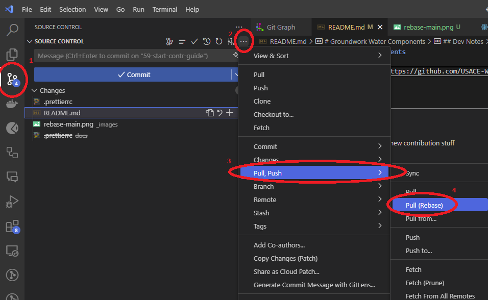
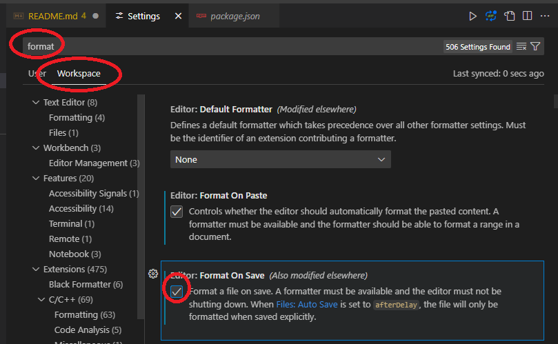

# Groundwork Water Components

## Getting Started

```bash
npm install @usace-watermanagement/groundwork-water --save
```

Will install the groundwork water components to your local `node_modules` directory, and add it to your packages.json for future use.

## Documentation

You can read the current Groundwork Water Documentation:  
[https://usace-watermanagement.github.io/groundwork-water/](https://usace-watermanagement.github.io/groundwork-water/)

[View Source on Github](https://github.com/USACE-WaterManagement/groundwork-water)

## Dev Notes

### Contribution Guidelines

- #### Pull Requests

  - Where possible, commits and pull requests should be [atomic](https://en.wikipedia.org/wiki/Atomic_commit):  
    _Keeping commits and PRs to one topic at a time_
    - To ensure reviewers can more easily review code revisions and not miss anything
    - Reduces the frequency of merge conflicts
    - Provides separation of concern (for bugs) when only one issue is merged at a time
  - You _must_ rebase your branch to main before you submit Pull Requests:
    - [ Terminal ] _From your branch run_
      1. `git fetch origin`
      2. `git rebase origin/main`
    - [ GUI ] In VSCode:  
      This can also be done in VSCode using the `Version Control` menu:  
       

- #### Workflow Recommendations

  - Use `npm link` to connect your project or the `docs` to the local generated `groundwork-water`
    - See the `link` script in `package.json` for details
  - Commit Often - [Atomic Commits](https://en.wikipedia.org/wiki/Atomic_commit)
    - i.e. if you update style of plot, do a commit related to "Update plotxyz style" then move on to next item/commit
  - Use VSCode or Similar Featured Editor to provide advanced features, save time, and integrate various utilities:
    - Command Prompt in VSCode : [Integrated Terminal](https://code.visualstudio.com/docs/terminal/getting-started)
    - [Tips & Tricks](https://code.visualstudio.com/docs/getstarted/tips-and-tricks)

- #### Extensions

  - [TailwindCSS](https://marketplace.visualstudio.com/items?itemName=bradlc.vscode-tailwindcss) -> Provides you inline tailwind options in your `className` blocks
  - [Prettier](https://marketplace.visualstudio.com/items?itemName=esbenp.prettier-vscode) -> Industry standard for styling, large community, and works in many programming languages
  - [Better Comments](https://marketplace.visualstudio.com/items?itemName=aaron-bond.better-comments) -> Highlight TODO and other type comments
  - [Code Spell Checker](https://marketplace.visualstudio.com/items?itemName=streetsidesoftware.code-spell-checker) -> Don't let the typos win
  - [Git Graph](https://marketplace.visualstudio.com/items?itemName=mhutchie.git-graph) -> Adds a graph icon on your "Source Control" line to let you view a visual representation of your git state

- #### Styling / formatting

  - Style often and consider [Format on Save for Workspace]()
  - Use the Prettier extension mentioned before to format with
    1. Press F1 to open command pallette
    2. Type "format", and then select "Format Document with..."
    3. "Select Prettier"

## Working Directories

_There are two directories of interest in this repository for Groundwork Water developers_

### /Docs

_Documentation Website_

The `/docs` directory contains the source code for the documentation website.

To run the docs you can do the following:

```bash
npm install
npm run build

cd docs
npm install
npm run dev
```

This will first _install_ the dependencies for the library then it `npm link`'s the package in the docs.

When you're making frequent changes you should consider importing the components directly from the package.
i.e.

```js
import { CWMSPlot } from "../path/to/lib/path/to/component";
```

This will install the dependencies, and then run the docs in development mode.

### Lib

_groundwork-water npm library_

The `/lib` directory contains the source code for the package itself.

These are the components that would be shared with the community but also within the docs themselves for testing and to showcase the components.

### Publishing

**_NOTE:_** You will first need to be added as a collaborator to the package on NPM.

To publish a new version of the package, run the following command:

```bash
npm run publish
```

This will build the package, and then publish it to NPM.

#### Steps:
1. merge any PRs
2. npm version --whatever (major,minor,patch)
3. npm publish
4. update docs GWW install version
5. push main
